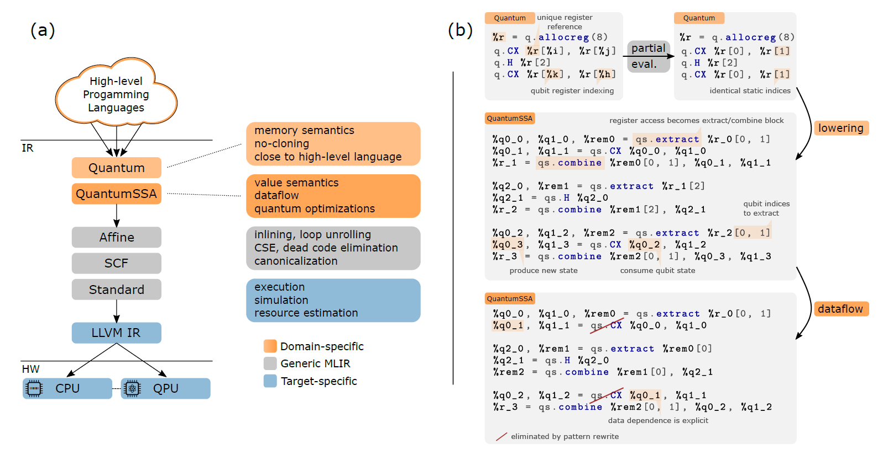
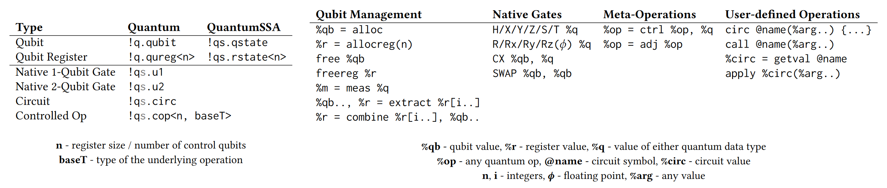

# Quantum Intermediate Representation for Optimization (QIRO)

> **Note**
> This repository contains archived code and is not under active development.
> The code was last synced with the MLIR project on September 25th 2020 ([commit: d2166076b8](https://github.com/llvm/llvm-project/tree/d2166076b882e38becf3657ea830ffd2b6a5695e)) and is most likely to work with a C++ build chain available at the time on Ubuntu 20.04, but should generally be considered untested.


## Introduction

This project contains a prototype implementation of a novel [intermediate representation](https://en.wikipedia.org/wiki/Intermediate_representation) (IR) specifically designed to enable and facilitate the optimization of hybrid quantum-classical programs. The IR is intended to be the core of a quantum compiler performant enough to handle the compilation & optimization of very large (application-scale) programs, which many of the current compilation frameworks focused on circuit compilation struggle with.

An academic treatment of the ideas behind the IR can be found in the publication [QIRO: A Static Single Assignment-based Quantum Program Representation for Optimization](https://doi.org/10.1145/3491247) (preprint available at [arXiv:2101.11030](https://arxiv.org/abs/2101.11030)).

### MLIR

[MLIR](https://doi.org/10.1109/CGO51591.2021.9370308) is a novel compiler infrastructure designed to facilitate the implementation of domain-specific and heterogeneous compilers via composable abstraction layers called *dialects*.
The quantum IR proposed by this project is implemented as two separate MLIR dialects and associated transformations.
For more details on the MLIR project please refer to the [official documentation](https://mlir.llvm.org/docs).

(Note that MLIR is now part of the [LLVM umbrella project](https://llvm.org/).)


### A Multi-Level Intermediate Representation for Quantum Programs

An abstract of the work on QIRO is reproduced below:

> We propose an IR for quantum computing that directly exposes quantum and classical data dependencies for the purpose of optimization.
> The Quantum Intermediate Representation for Optimization(QIRO) consists of two dialects, one input dialect and one that is specifically tailored to enable quantum-classical co-optimization.
> While the first employs a perhaps more intuitive memory-semantics (quantum operations act on qubits via side-effects), the latter uses value-semantics (operations consume and produce states) to integrate quantum dataflow in the IR’s Static Single Assignment (SSA) graph.
> Crucially, this allows for a host of optimizations that leverage dataflow analysis.
> We discuss how to map existing quantum programming languages to the input dialect and how to lower the resulting IR to the optimization dialect.
> We present a prototype implementation based on MLIR that includes several quantum-specific optimization passes.
> Our benchmarks show that significant improvements in resource requirements are possible even through static optimization.
> In contrast to circuit optimization at run time, this is achieved while incurring only a small constant overhead in compilation time, making this a compelling approach for quantum program optimization at application scale.

The proposed compilation stack is shown in the figure below, as well an illustration of the core idea behind hybrid quantum-classical optimization:



The quantum type system and instruction set is summarized in the tables below (dialect prefixes and types are omitted for operations):




## Installation

> **Note**
> Development of the project has moved to Linux.
> Legacy instructions for building on Windows have been preserved at the end of this section.

The primary dependency of the QIRO project is the MLIR & LLVM compiler libraries and tools.
They can be built from source on Ubuntu (or compatible distro) using the following set of commands.

Build dependencies (GCC should work as well):

```bash
sudo apt update
sudo apt install cmake ninja-build clang lld ccache
```

Compiling MLIR:

```bash
git clone https://github.com/llvm/llvm-project.git
cd llvm-project && git checkout d2166076b8
mkdir llvm-project/build && cd build
cmake ../llvm -G Ninja \
    -DCMAKE_BUILD_TYPE=Release \
    -DLLVM_BUILD_EXAMPLES=OFF \
    -DLLVM_TARGETS_TO_BUILD="host" \
    -DLLVM_ENABLE_PROJECTS="mlir" \
    -DLLVM_ENABLE_ASSERTIONS=ON \
    -DCMAKE_C_COMPILER=clang -DCMAKE_CXX_COMPILER=clang++ -DLLVM_ENABLE_LLD=ON \
    -DLLVM_CCACHE_BUILD=ON
cmake --build . --target check-mlir
cmake --build .
```

Compiling QIRO:

```bash
git clone https://github.com/dime10/QIRO.git
mkdir QIRO/build && cd QIRO/build
cmake .. -G Ninja \
    -DCMAKE_BUILD_TYPE=Release \
    -DLLVM_ENABLE_ASSERTIONS=On \
    -DMLIR_DIR={PATH TO llvm-project/build/lib/cmake/mlir} \
    -DCMAKE_C_COMPILER=clang -DCMAKE_CXX_COMPILER=clang++ -DLLVM_ENABLE_LLD=ON
cmake --build .
```

---

First, make sure to download and build LLVM with the MLIR component. The project can be built from source using [CMake](https://cmake.org/).

To do so on Windows, you can follow the steps below. For other systems, please refer to the [MLIR](https://mlir.llvm.org/getting_started/)/[LLVM](https://llvm.org/docs/GettingStarted.html) documentation.

Building MLIR on Windows:
* Get the [Build Tools for Visual Studio 2019](https://visualstudio.microsoft.com/thank-you-downloading-visual-studio/?sku=BuildTools&rel=16). Select the C++ build tools, Windows 10 SDK, and CMake tools.
* Get the LLVM requirements: [Python](https://www.python.org/downloads/) (>=2.7), [WinGnu32](http://getgnuwin32.sourceforge.net/). Make sure all of these are available in your PATH variable.
* Navigate to your project folder and download the LLVM source: `git clone https://github.com/llvm/llvm-project.git`
* Execute the below commands in a *Developer Command Prompt for VS 2019*, or execute `vcvarsal.bat x64` beforehand:
    * `cd llvm-project`
    * `cmake -Bbuild -Hllvm -G "Visual Studio 16 2019" -DLLVM_ENABLE_PROJECTS=mlir -DLLVM_BUILD_EXAMPLES=ON -DLLVM_TARGETS_TO_BUILD="host" -DCMAKE_BUILD_TYPE=Debug -Thost=x64 -DLLVM_ENABLE_ASSERTIONS=ON`
    * `cmake --build build --target check-mlir`

Building this project:
* Navigate to your project folder and download this source code: `git clone https://github.com/dime10/QIRO.git`
* Execute the following commands:
    * `cd QIRO`
    * `cmake -Bbuild -H.`
    * `cmake --build build --target quantum-opt`


## Usage

While the QIRO prototype is not integrated into an end-to-end compiler, it can be used to optimize quantum programs, as well as compile and execute them (to some degree).
A typical build pipeline might look as follows:

- program transformation using the `quantum-opt` tool:
    - input dialect to optimization dialect conversion
    - quantum program optimization
    - conversion to resource estimation program for "execution" on CPU
- translation to LLVM IR using the `mlir-translate` tool
- LLVM IR compilation + linking using `llc` and/or `clang`

See the [quantum-opt](./quantum-opt/) tool for more information on its usage.

Additionally, the above pipeline has been combined into a JIT compilation and execution tool located in [run-jit](./run-jit/).
