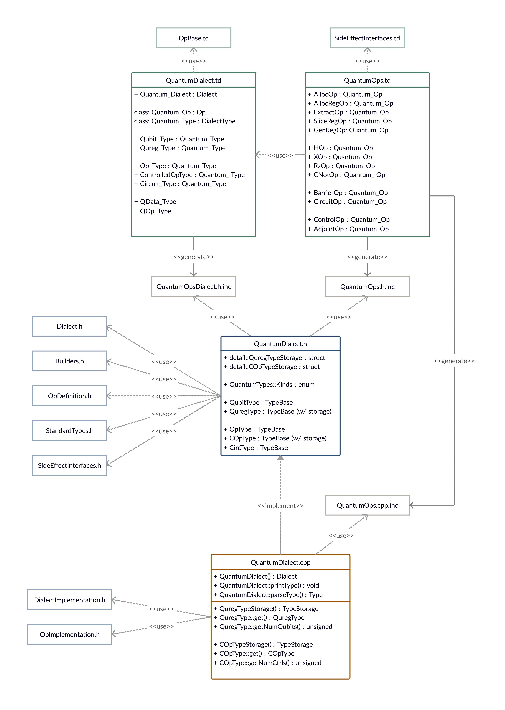

This is the quantum optimizing compiler project in MLIR.
The project can be built using the CMake file in this directory.
First, make sure to download and build llvm (at least the mlir part),
then run:
* `cmake -Bbuild -H.`
* `cmake --build build --target quantum-opt`

To manually generate .h.inc and .cpp.inc files via TableGen use:
* `mlir-tblgen -gen-dialect-decls QuantumOps.td -I ../../../llvm-project/mlir/include -o QuantumOpsDialect.h.inc`
* `mlir-tblgen -gen-op-decls QuantumOps.td -I ../../../llvm-project/mlir/include -o QuantumOps.h.inc`
* `mlir-tblgen -gen-op-defs QuantumOps.td -I ../../../llvm-project/mlir/include -o QuantumOps.cpp.inc`

NOTE: The project assumes the following directory structure, be sure to adjust the mlir build path in the top level CMakeLists.txt file, as well as for the above commands, accordingly.
```
ProjectFolder
|-> git
|   |-> QCompile
|   |   |-> include
|   |   |-> lib
|   |   |   |-> IR
|   |   |-> quantum-opt
|   |   |-> test
|-> llvm-project
|   |-> ...
|   |-> mlir
|   |-> ...
```

Here is an overview of the different modules used in this project and how they relate to each other:

